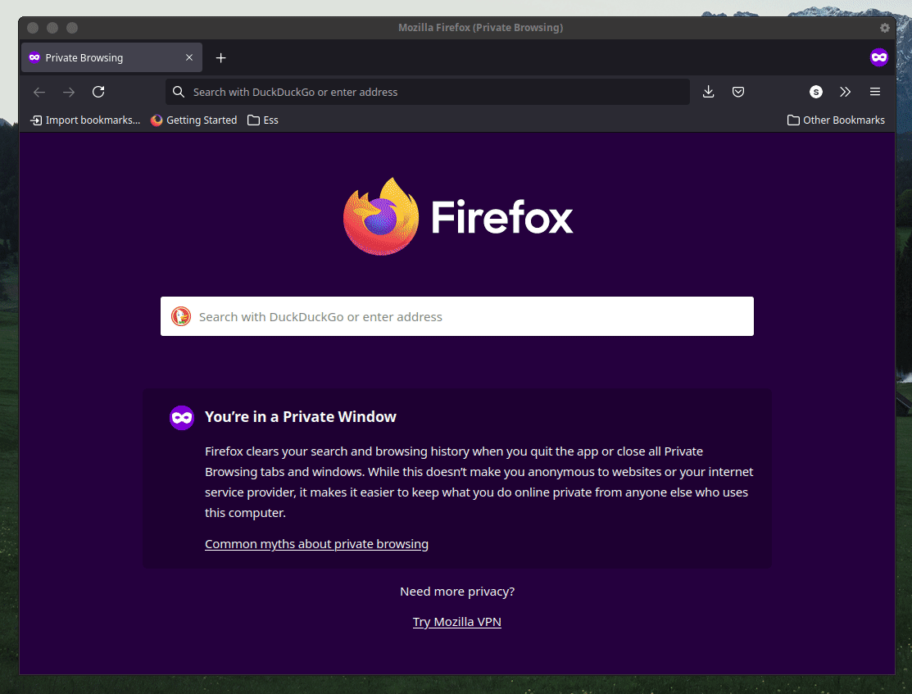

# grpc-goui

A Golang wrapper over grpc-ui with HTML templates to spawn mutiple reflection based clients connections



## Pre-requisites [Binary Run]

Following parameters need to be exposed since required by the binary to be consumed internally.

```bash
export PATH=${PATH}:${PWD}/assets/
export EXPOSED_PORTS=8081...8090
export INTERFACE=eth0
```

## Build

1. To complete build
    * Run `make`
1. To build binaries
    * Run `make install`

## Pre-requisites [Docker Run]

Expose all ports in docker run command (Equivalent to 8081...8090)

1. Run: `docker run -it --rm -p 8080:8080 -p 8081:8081 github.com/shubham-gaur:0.0.1`

## Clean up

1. To cleanup
    * Run `make clean`
